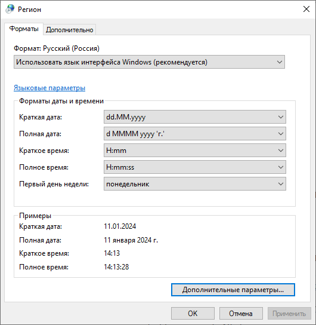

Глава 1. Интернационализация и Локализация.
-------------------------------------------

Введение.
~~~~~~~~~~~~~

**Интернационализация** (англ. *internationalization* или сокращенно
*i18n*) – это процесс проектирования и разработки ПО, который позволяет
легко перевести продукт, приложение или документ на другие языки и
регионы без необходимости внесения технических изменений. По сути, речь
идет о том, чтобы продукт или услуга разрабатывались таким образом,
чтобы не отдавать предпочтение одной культуре или языку по сравнению с
другой, и подготовить их для мировой аудитории.

**Локализация** (англ. *localization* или *l10n*) – это процесс перевода
и культурной адаптации продукта к особенностям определенной страны,
региона.

В принципе можно пойти в лоб и создать по одному приложению на каждый
регион/страну. Такой вариант очень дорого и неудобно поддерживать, ведь
работать нужно будет с каждым продуктом отдельно. Далее приходит на ум
более удобный вариант — создать приложение, которое включает в своём
коде локализацию для всех необходимых вам регионов/стран. Вариант уже
лучше, но и его достаточно сложно будет поддерживать. Плюс велика
вероятность, что данные локализации будут вплотную пересекаться с
основным кодом приложения. Далее мы приходим к мысли, что было бы удобно
создать продукт, в котором региональные и культурные особенности (текст,
картинки, форматы даты, времени и т.п.) будут вынесены в отдельные
блоки. Никакого хардкода в переводимых местах, а блоки будут
подгружаться при использовании того или иного региона/страны. Данный
набор ресурсов называют “локалью” (locale).

Реализацию интернационализации обычно начинают на ранних этапах проекта,
чтобы подготовить ваш продукт к будущей локализации. Во время процесса
интернационализации определяют, что будет изменяться для будущих локалей
(например текст, изображения и т.п.) и выносят эти данные во внешние
файлы. Также во время интернационализации (и при локализации тоже) нужно
добавить возможность изменять календари, форматы даты, времени, цифр,
денежных символов и в целом символов, специфичных для определенных
языков и многое другое. Как итог, в идеальном варианте, добавление новой
локали не должно требовать от нас изменения исходного кода продукта.

Ну и, конечно, очень тесно связана с этим процессом локализация. На этой
стадии участники разработки продукта работают с локациями — внешними
ресурсами (файлами), которые подгружаются приложением для загрузки
локализации для вашей страны/региона. Основные зоны локализации, то есть
адаптации к местным нормам и традициям:

-  текст и связанные с ним функции (например сортировка, поиск,
   поддержка спец. символов и т.п.)
-  документация (мануалы, гайды, FAQ, разделы справки и т.п.)
-  форматы даты и времени (Месяц/Дата/Год (США) или День Месяц Год
   (Россия))
-  формат чисел (разделитель десятичных знаков точка или запятая)
-  формат денежных величин
-  поддержка различных календарей (например, неделя начинается с
   понедельника (Европа) или с воскресения (США), праздники по лунному
   календарю (Китай))
-  изображения (картинки, иконки)
-  звук (в частности, озвучка, если таковая имеется)
-  реклама (текстовая, аудио, видео)
-  и т.д.

Если говорить по-простому, то **интернационализация** — **это
проектирование и написание кода**, пригодного для перевода на разные
языки.

А **локализация** — **это перевод и культурная адаптация** всех
элементов, такие как тексты, картинки, шрифты.

Подробнее можно ознакомиться здесь:

http://www.motaword.com/ru/blog/localization-vs-internationalization

https://habr.com/ru/articles/532836/

https://phrase.com/blog/posts/translation-technology/

Локали.
~~~~~~~

**Локали** — это набор настроек, которые определяют язык, используемый
системой, а также региональные особенности, такие как денежные знаки,
формат чисел, даты и времени и наборы символов.

Если у вас Windows, то выполните команду

.. code:: bash

   intl.cpl

Вы увидите региональные настройки и в дополнительных параметрах форматы
чисел, денег, времени, дат.

.. image:: _static/002.png
.. image:: _static/003.png
.. image:: _static/004.png
.. image:: _static/005.png

Это все требует не просто перевода, а подлежит приведению в соответствии
с особенностями региона.

Поскольку нам интересен запуск на сервере, то мы будем рассматривать все
на примере ОС Linux. В Linux эти настройки хранятся в переменных среды.
Выполним команду:

.. code:: bash

   locale

И получим список переменных среды, в которых хранятся все региональные
настройки:

::

   LANG=en_US.UTF-8
   LANGUAGE=
   LC_CTYPE="en_US.UTF-8"
   LC_NUMERIC="en_US.UTF-8"
   LC_TIME="en_US.UTF-8"
   LC_COLLATE="en_US.UTF-8"
   LC_MONETARY="en_US.UTF-8"
   LC_MESSAGES="en_US.UTF-8"
   LC_PAPER="en_US.UTF-8"
   LC_NAME="en_US.UTF-8"
   LC_ADDRESS="en_US.UTF-8"
   LC_TELEPHONE="en_US.UTF-8"
   LC_MEASUREMENT="en_US.UTF-8"
   LC_IDENTIFICATION="en_US.UTF-8"
   LC_ALL=

А сами переводы для программ лежат по пути ``/usr/share/locale/`` (или
``/usr/local/share/locale`` или в директории ``приложение/locale``) в
папках с именем языка и подпапкой, соответствующей переменной среды для
которой перевод. Например, для русского языка это ``ru/LC_MESSAGES``, в
этой папке лежат скомпилированные переводы для приложений по имени
каждого приложения:

::

   apt.mo
   debconf.mo
   dpkg.mo
   mc.mo
   xdg-user-dirs.mo

А само имя нашего приложения в дальнейшем для перевода обозначается в
терминологии инструментов перевода как **домен**. Если мы создаем
приложение на Python как пакет, то доменом у нас будет название
приложения, совпадающее с папкой пакета.

Для нашего приложения нам нет необходимости переводить большой объем
разных данных и устанавливать в систему. Мы будем переводить только
строки, которые выводятся пользователю LC_MESSAGES.

При запуске любого приложения (не важно на каком языке это все написано,
python или C) инструменты перевода производят поиск файлов перевода для
подстановки переведенных строк в папке, указанной в настройках и файлы с
именем домена. Для нашего приложения это будет папка с именем locales в
корне проекта. Далее это мы подробнее разберем на практике.
